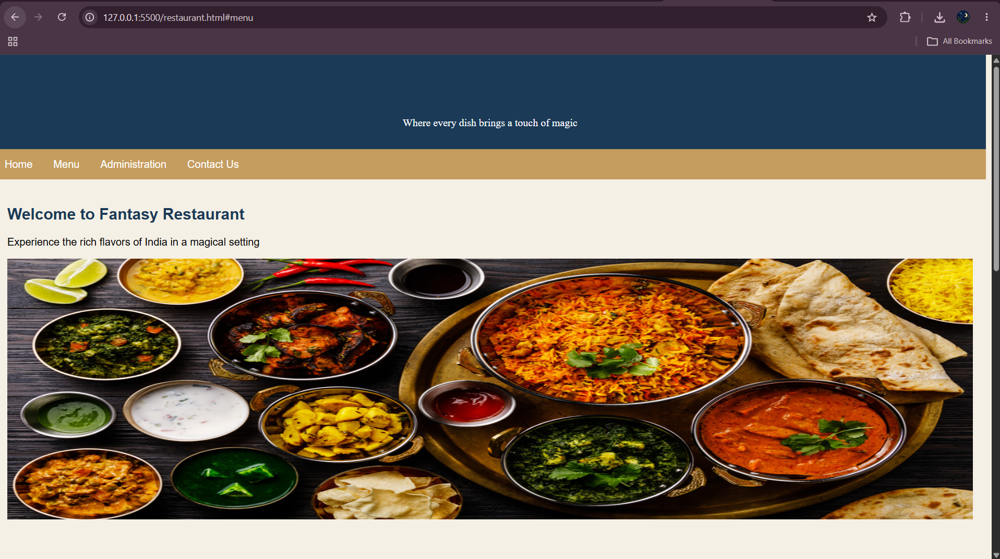
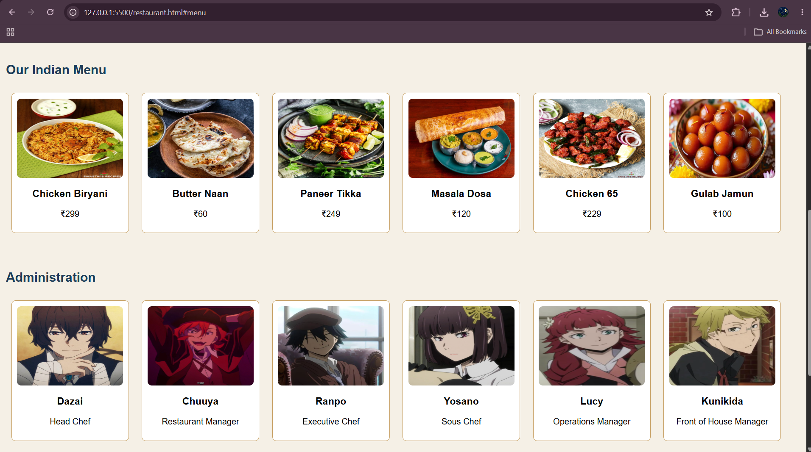
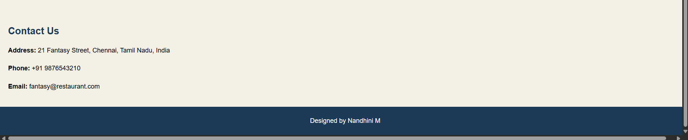

# Ex.05 Restaurant Website
# Date: 22-08-26

# AIM:
To develop a static Restaurant website to display the food items and services provided by them.

# DESIGN STEPS:
## Step 1:
Requirement collection.

## Step 2:
Creating the layout using HTML and CSS.

## Step 3:
Updating the sample content.

## Step 4:
Choose the appropriate style and color scheme.

## Step 5:
Validate the layout in various browsers.

## Step 6:
Validate the HTML code.

## Step 7:
Publish the website in the given URL.

# PROGRAM:

```
<html>
<head>
  <title>FANTASY RESTAURANT</title>

  <style>
    body {
      font-family: Arial, sans-serif;
      margin: 0;
      padding: 0;
      background-color: #f5f0e6;
    }

    header {
      background-color: #1b3a57;
      color: white;
      padding: 15px;
      text-align: center;
    }

    nav {
      background-color: #c59d5f;
      overflow: hidden;
    }

    nav a {
      float: left;
      display: block;
      color: white;
      text-align: center;
      padding: 14px 16px;
      text-decoration: none;
    }

    nav a:hover {
      background-color: #f5f0e6;
      color: #1b3a57;
    }

    section {
      padding: 20px;
    }

    h1, h2 {
      color: #1b3a57;
    }

    .menu-item, .admin-member {
      border: 1px solid #c59d5f;
      border-radius: 8px;
      padding: 10px;
      margin: 10px;
      display: inline-block;
      width: 200px;
      text-align: center;
      background-color: white;
    }

    .menu-item img, .admin-member img {
      width: 100%;
      height: 150px;
      border-radius: 8px;
    }

    footer {
      background-color: #1b3a57;
      color: white;
      text-align: center;
      padding: 10px;
      position: relative;
      bottom: 0;
      width: 100%;
    }

    .contact-info {
      line-height: 1.8;
    }
  </style>
</head>

<body>

  <header>

    <h1 style="font-family:'Times New Roman', Times, serif">
      FANTASY RESTAURANT
    </h1>

    <p style="font-family:'Times New Roman', Times, serif;">
      Where every dish brings a touch of magic
    </p>

  </header>


  <nav>

    <a href="#home">Home</a>
    <a href="#menu">Menu</a>
    <a href="#admin">Administration</a>
    <a href="#contact">Contact Us</a>

  </nav>


  <section id="home">

    <h2>Welcome to Fantasy Restaurant</h2>

    <p>Experience the rich flavors of India in a magical setting</p>

    

  </section>


  <section id="menu">

    <h2>Our Indian Menu</h2>

    <div class="menu-item">

      

      <h3>Chicken Biryani</h3>

      <p>₹299</p>

    </div>


    <div class="menu-item">

      

      <h3>Butter Naan</h3>

      <p>₹60</p>

    </div>


    <div class="menu-item">

      

      <h3>Paneer Tikka</h3>

      <p>₹249</p>

    </div>


    <div class="menu-item">

      

      <h3>Masala Dosa</h3>

      <p>₹120</p>

    </div>


    <div class="menu-item">

      

      <h3>Chicken 65</h3>

      <p>₹229</p>

    </div>


    <div class="menu-item">

      

      <h3>Gulab Jamun</h3>

      <p>₹100</p>

    </div>

  </section>


  <section id="admin">

    <h2>Administration</h2>


    <div class="admin-member">

      

      <h3>Dazai</h3>

      <p>Head Chef</p>

    </div>


    <div class="admin-member">

      

      <h3>Chuuya</h3>

      <p>Restaurant Manager</p>

    </div>


    <div class="admin-member">

      

      <h3>Ranpo</h3>

      <p>Executive Chef</p>

    </div>


    <div class="admin-member">

      

      <h3>Yosano</h3>

      <p>Sous Chef</p>

    </div>


    <div class="admin-member">

      

      <h3>Lucy</h3>

      <p>Operations Manager</p>

    </div>


    <div class="admin-member">

      

      <h3>Kunikida</h3>

      <p>Front of House Manager</p>

    </div>

  </section>


  <section id="contact">

    <h2>Contact Us</h2>

    <div class="contact-info">

      <p>
        <strong>Address:</strong>
        21 Fantasy Street, Chennai, Tamil Nadu, India
      </p>

      <p>
        <strong>Phone:</strong>
        +91 9876543210
      </p>

      <p>
        <strong>Email:</strong>
        fantasy@restaurant.com
      </p>

    </div>

  </section>


  <footer>

    <p>Designed by Nandhini M</p>

  </footer>


</body>
</html>
```
# OUTPUT:






# RESULT:
The program for designing software company website using HTML and CSS is completed successfully.
